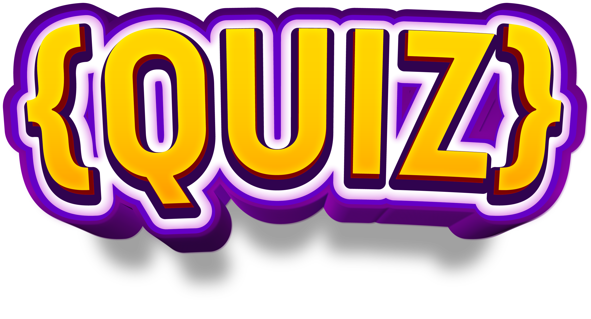

<p align=center>

</p>

### Welcome to Coding Quiz! A Coding Quiz made by students.

Made in React Native, Coding Quiz contains 5 different quiz categories. Create a user and play!

## Content
- <a href="#how-to-run">How to run the project</a>
- <a href="#requirements">Requirements</a>
- <a href="#about">About the project</a>
- <a href="#features">Features</a>
- <a href="#components">Components</a>
- <a href="#demarcation">Demarcations</a>

## A Quiz app created with:

- <a href="https://reactjs.org/">React Native</a>
- <a href="https://www.typescriptlang.org/">TypeScript</a>
- <a href="https://expo.dev/">Expo</a>
- <a href="https://github.com/jquense/yup">yup</a>
- <a href="https://formik.org/">formik</a>
- <a href="https://styled-components.com/">styled components</a>
- <a href="https://www.figma.com/file/NmwxIIAbFnFADzhpNqDUks/Untitled">figma (link to our figma)</a>

# <div id="features">Features</div>

## Quiz
The game itself!

Choose between five categories: CSS, HTML, React, JavaScript and TypeScript.


Each quiz session is 10 questions, every question has a 30 second timer. The more questions you get right, the higher your R/Q will be (Rights per Quiz)!

## User

### CRUD
Create, Edit and delete user(s).

### Avatar
Create your own customizable avatar, the avatar can later be modified.

### Leaderboard
Users are displayed in the leaderboard section to show who's the best of the best and worst of the worst

### Achievements
Each user is created with an empty array of achievements.

As you play the game, you can earn achievements!

Earned achievements will have a green background in the achievements modal.

Note: Only two achievements are available in this version.

### Statistics
After each game session is done, you can view stats on your performance.

These stats stored in the user information section (click on your avatar in the home screen)

## Settings

### Music/Effects
Toggle these on/off as you wish.

Music is playing in the menu and in-game.

Effects are played on button presses.

### Theme
Toggle between a darker purple theme and a lighter green theme.

### Vibration/Haptics
Toggle these on/off as you wish.

Haptics are used on button presses and vibration after a game is played.

# <div id="components">Components</div>
## React Native components used
- View - Basically a div
- ScrollView - Scrollable View
- Image - Show images
- Modal - Show stats, avatar etc.
- Switch - Toggle used in settings
- Vibration - Vibration after GameOver
- BackHandler - Disable back button on Android
- KeyboardAvoidingView - Used to not push content when using the built-in keyboard
- Platform - Control OS

## Expo components
- AsyncStorage - Save Settings, Users and Stats
- AV - Play music and effects
- Font - Load external font
- Haptics - Vibrate on button presses
- SplashScreen - Show an image while stuff is loading
- WebBrowser - Used to browse to Github

## External components
- Modalize - From the bottom modal (used in Settings)
- BigHead - Avatar
- UUID - Generate ID for user
- Styled Components - Styling

# <div id="about">About the project</div>
This group assignment was dealt to the second year students of <a href="https://www.boras.se/utbildningochforskola/yrkeshogskolaniboras/program/systemutvecklarenet">SUVNET21, Borås Yrkeshögskola.</a>

This group consisted of <b><a href="https://github.com/4l3x91">Alex</a> - <a href="https://github.com/carlafalk">Carl</a> - <a href="https://github.com/osci-the-orca">Oscar</a> - <a href="https://github.com/ThaDDDen">Tommy</a></b>.

# <div id="how-to-run">How to run</div>
## Requirements to set up
```
node.js
npm
```
## Set up and run
```
npm install
npm start
```
## Run on mobile device
Open the Expo app on your phone and scan the QR code in the terminal

## Run on Android Studio
After setting up and starting the app, press A in the terminal to launch the app on your emulated phone

# <div id="demarcation">Demarcations</div>
## Achievements
In this version, only two achievements are available.
You can earn "Hello World" and "No-lifer", after one and ten respectively played games.
Earned achievements will have a green background in the achievements modal.

## Notifications
Notifications have not been implemented as of yet.

# <div id="requirements">Requirements</div>
## Krav godkänt:
✅ Projektet använder minst 6 stycken RN-komponenter och minst 6 stycken Expo
      komponenter

✅ De utvalda komponenterna ska antecknas i er README tillsammans med en lista över
      genomförda krav

✅ Git & GitHub har använts

✅ Projektmappen innehåller en README.md fil - (läs ovan för mer info)

✅ Uppgiften lämnas in i tid!

✅ Muntlig presentation är genomförd

## Krav för väl godkänt:
✅ Alla punkter för godkänt är uppfyllda

✅ React Navigation används för att skapa en bättre upplevelse i appen

✅ Ytterligare en valfri extern modul används i projektet

✅ Prototyper för applikation tas fram innan den implementeras. Bilder på prototypen
      skall finnas i projektet vid inlämning